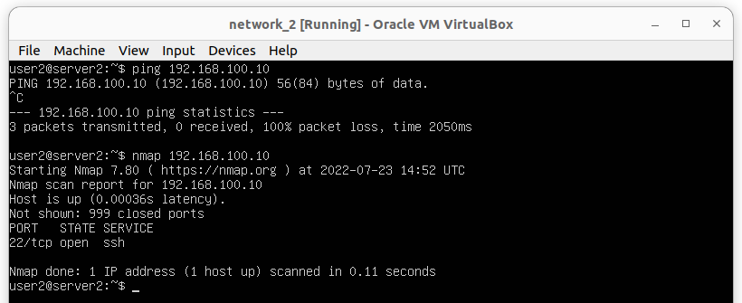
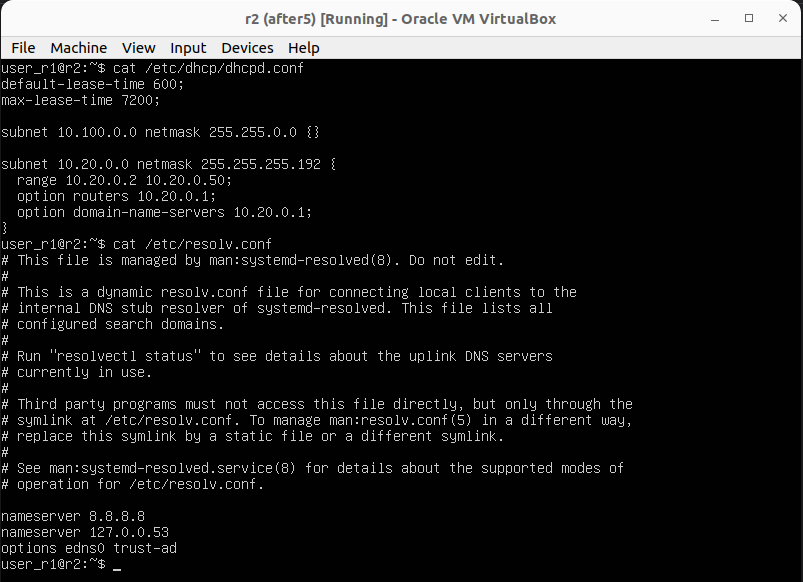

## PART_I

* Networks and Masks
  * Network address of 192.167.38.54/13 is 192.167.38.
  * Subnet mask 255.255.255.0 is:
    * /24 in prefix format.
    * 11111111.11111111.11111111.00000000 in binary format.
  * Prefix /15 is:
    * 255.254.0.0 in normal format.
    * 11111111.11111110.00000000.00000000 in binary format.
  * Binary format 11111111.11111111.11111111.11110000 is:
    * 255.255.255.240 in normal format.
    * /30 in prefix format.
  * 12.167.38.4 IP address with subnet mask:
    * /8 has:
      * min host IP address 12.0.0.1.
      * max host IP address 12.255.255.254.
    * 11111111.11111111.00000000.00000000 has:
      * min host IP address 12.167.0.1.
      * max host IP address 12.167.255.254
    * 255.255.254.0 has:
      * min host IP address 12.167.38.1.
      * max host IP address 12.167.39.254.
    * /4 has:
      * min host IP address 0.0.0.1.
      * max host IP address 15.255.255.254.
* localhost
  * The IP address range 127.0.0.0 – 127.255.255.255 is reserved for loopback, so:
    * 128.0.0.1 and 194.34.23.100 is not accessible.
    * 127.0.0.2 and 127.1.0.1 are accessible.
* Network ranges and segments
  * Private IP addresses ranges are 10.0.0.0 - 10.255.255.255, 172.16.0.0 - 172.31.255.255 and 192.168.0.0 - 192.168.255.255, so:
    * 10.0.0.45, 192.168.4.2, 172.20.250.4, 172.16.255.255 and 10.10.10.10 are private IP addresses.
    * 134.43.0.2, 172.0.2.1, 192.172.0.1, 172.68.0.2, 192.169.168.1 are public IP addresses.
* 10.10.0.2, 10.10.10.10, 10.10.1.255 are possible for 10.10.0.0/18 network.
* 10.0.0.1, 10.10.100.1 are not possible for 10.10.0.0/18 network.

## PART_II

### 1

### 2

## PART_III

### 1
8 Mbps is 1 MB/s, 100 MB/s is 800000 Kbps, 1 Gbps is 1000 Mbps

### 2

## PART_IV

### 1

### 2

* ws1 allowed pinging at the end, in contrast ws2 denied to pinging

### 3

## PART_V

Because in case of 10.10.0.0/18 there is defined an ip gateway for accessing. In case of any other non defined addresses default gateway will be choosen

## PART_VI

## PART_VII

